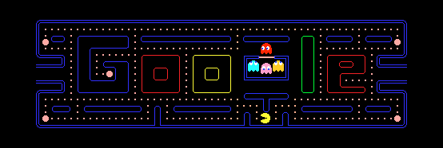

# Final Coding

Click anywhere on the screen to see the red and blue dots flow.

I used a time-based animation for this effect.

- The blue dots continuously cycle downward.
- The red dots cycle to the right.
- Both types of dots move at 60 frames per second.

My inspiration comes from Pac-Man, an old game composed of various colored blocks. Similar to my idea, Pac-Man moves on its own, demonstrating sequential movement of different colored squares.

In the overall section of the code, I added a variable Animating to keep track of the state of the animation. The frame rate is set to 60 frames per second in the setup function to ensure a smooth animation. The smooth movement of the dots is achieved by utilizing frameCount, where the redDots and blueDots can be moved continuously. The red dots move horizontally and their position is updated based on (frameCount % width) / width, while the blue dots move vertically and their position is updated based on (frameCount % height) / height These adjustments ensure that the dots loop back to the starting point when they reach the grid boundaries, creating a continuous animation effect. This approach allows the red and blue points to move across the grid in a smooth and natural way, enhancing the visual impact of the animation.

